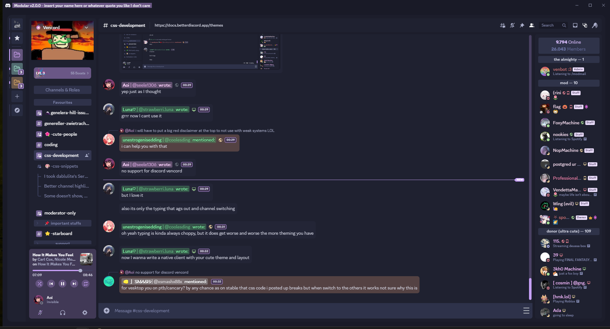
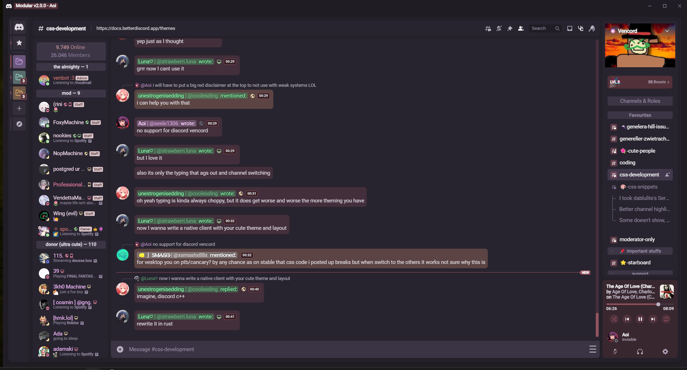

# Modular - A theme made for Vesktop

## Introduction

This is one of the first themes that is made exclusively for **Vencord's own client, Vesktop**.

> [!IMPORTANT]
> This theme is only guaranteed to work on Vesktop. Get the latest build here: [Releases - Vencord/Vesktop](https://github.com/Vencord/Vesktop/releases)

## Features

- High customizability:
  - **_Add a pre-made Nitro theme or background of your choice_** and adjust the brightness, blur as well as transparency
  - **Client global accent** using the HSL scheme
  - A **second accent color** to highlight important elements and add style
  - **Modules** (user panel, member list, guild list etc.) that can be flipped around
  - Adjustable **chat bubble and status colors**
  - Adjustable **primary and code font**
  - **Add a custom name on the titlebar** to make the layout more personal
- **A revamped look** for many elements, including profile panels and modals, Spotify controls, guild list and many more!
- **Compatibility and quality of life changes** for many of Vesktop's existing plugins
- Several **_add-ons_** are available separately in the `modular.theme.css` file
- Active support (to my ability)
- Some of the elements of this theme are available separately as snippets. Check them out [here](https://github.com/SEELE1306/CSS-Snippets).

## Screenshots

### This is what you will see upon loading the theme for the first time:

### Layouts can be customized to something like this:

## Apply and customize

### Apply

There are several methods to apply this theme:

  

Via Local Themes:

- Download the file `modular.theme.css` from this repository.
- Open Settings > Vencord > Themes > Local Themes > Open Themes Folder.
- Paste the downloaded file into the **themes** folder.

  

Via Online Themes

- Open Settings > Vencord > Themes > Online Themes.
- Paste the following link into **Theme Links**: `https://seele1306.github.io/Modular/modular.theme.css`
- Enter or mouse-click outside the Online Themes box to apply

Via QuickCSS

- Open Settings > Vencord > Vencord > Open QuickCSS File
- Paste the following line as your **first line (ahead of any other custom CSS)**: `@import url(https://seele1306.github.io/Modular/modular.theme.css);`.

### Customization

A large part of the following guide is also available inside the `modular.theme.css` file.

To start customizing your layout, copy and paste the file `modular.theme.css` into your QuickCSS.

Additional supported add-ons are available in `modular.theme.css`. For more snippets, you can visit [here](https://github.com/SEELE1306/CSS-Snippets).

## Special thanks to

My theme, at the end of the day, is just a compilation of the many snippets that I have found. I will try my best to credit all the users whose snippets I have ultilized, but if your name does not show up here, feel free to contact me.

### Credits

[coolesding](https://github.com/coolesding), [Saltssaumure](https://github.com/Saltssaumure), [DaBluLite](https://github.com/DaBluLite), [Vendicated](https://github.com/Vendicated), [CodeF53](https://github.com/CodeF53), AkiraSimplex (`akirasimplex` on Discord)

## Issues

You tell me!
